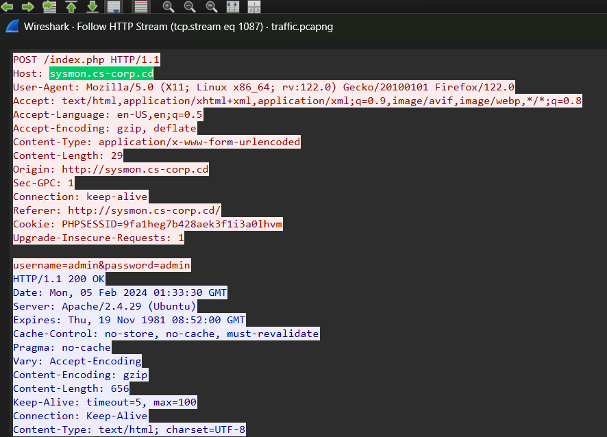

# APTNightmare

This challenge give us the scenario:

> We neglected to prioritize the robust security of our network and servers, and as a result, both our organization and our customers have fallen victim to a cyber attack. The origin and methods of this breach remain unknown. Numerous suspicious emails have been detected. In our pursuit of resolution, as an expert forensics investigator, you must be able to help us.

These are all the files we have:


Unzip 2 zipped files and we get:


All we got are an pcapng (network traffic), an C drive of a Windows computer, a memory dump file of a server and something else.

## Question

### 1. What is the IP address of the infected web server?

To answer this question, I open the pcapng file and use the filter: `http.request` and I see:


The IP address 192.168.1.5 is continuously making requests to the IP address 192.168.1.3. So maybe the IP 192.168.1.3 is the IP address of the web server.

=> **192.168.1.3**

### 2. What is the IP address of the Attacker?

As I mentioned in the previos question, the IP 192.168.1.5 was sending many requests to the web server, so it's the attacker's IP address.

=> **192.168.1.5**

### 3. How many open ports were discovered by the attacker?

I have known the IP address of the attacker and the web server, so I use tshark with this command to find out the number of ports which was discovered by the attacker:

```tshark -r traffic.pcapng -Y "ip.src == 192.168.1.3 && ip.dst == 192.168.1.5 && tcp.flags.syn == 1 && tcp.flags.ack == 1" -T fields -e tcp.srcport | sort -n | uniq | wc -l```

This command count the ports that the web server send SYN-ACK to attacker


The number is 15 but it's not the correct answer so I 

### 4. What are the first five ports identified by the attacker in numerical order during the enumeration phase, not considering the sequence of their discovery?
 
We knew the ports which was discovered by the attacker, so I use this command to get those port and sort by the five smallest port:

```
tshark -r traffic.pcapng -Y "ip.src == 192.168.1.3 && ip.dst == 192.168.1.5 && tcp.flags.syn == 1 && tcp.flags.ack == 1" \
-T fields -e tcp.srcport | sort -n | uniq | head -n 5
```


=> **25,53,80,110,119**

### 5. The attacker exploited a misconfiguration allowing them to enumerate all subdomains. What is the method used commonly referred to as (e.g, Unrestricted Access Controls)?

There are many methods in this situation but when I look at the format of the answer, I guess it is **DNS Zone Transfer**, so to confirm if I am correct, I use this filter to find the **AXFR** type of DNS protocol:

`dns.qry.type == 252`


=> **DNS Zone Transfer**

### 6. How many subdomains were discovered by the attacker?

In the previous question, I identified the domain as cs-corp.cd. There are two packets (Query–Response), and in packet 9396, when examining the packet details, we can see an "Answer" section that contains a list of the subdomains in use.


=> **9**

### 7. What is the compromised subdomain (e.g., dev.example.com) ?

First, I use this filter to get all the packet related to the attacker IP and subdomain:

`ip.src == 192.168.1.5 && http.host contains ".cs-corp.cd"`

Look at the packet, I see that attacker is trying to post files to server:


Follow HTTP Stream to see which subdomain is compromised:



=> **sysmon.cs-corp.cd**

### 8. What username and password were used to log in?

Now I know the subdomain the attacker is trying to access so I use this filter and find which packet that the attacker accessed to the server.

`ip.src == 192.168.1.5 && http.host contains "sysmon.cs-corp.cd"`


After a lot of POST request, the attacker send an GET request (the file: dashboard.php) which mean the attacker could access to the server. Follow this HTTP stream and we could find out the username and password.


We can see the username and the password here but %40 is present for the **@** character, so the correct username and password is:

=> **admin:Pass@000_**

### 9. What command gave the attacker their initial access ?

